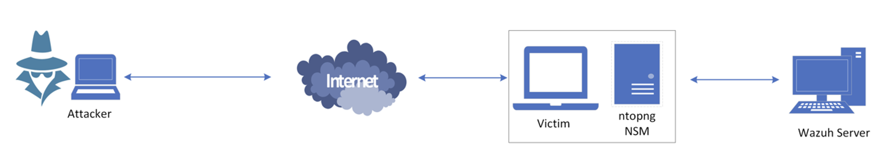
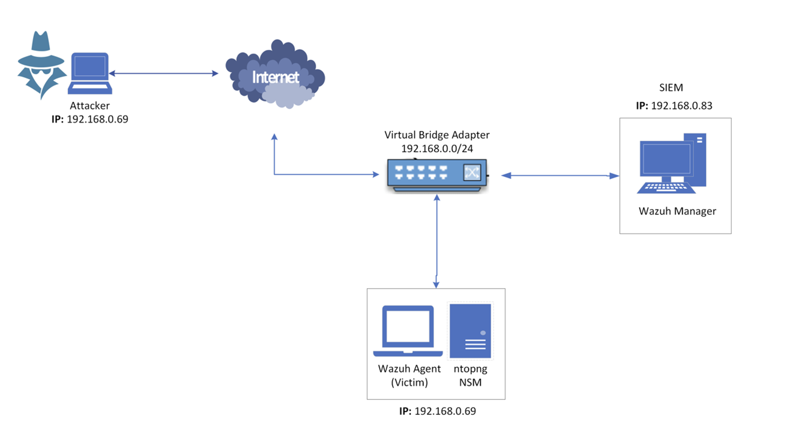

# 🛡️ Security Information and Event Management (SIEM) Integration with Network Security Monitoring Tools

## 📌 Overview

This project presents the development and implementation of a **unified threat detection and monitoring system** by integrating **Wazuh (SIEM)** with **ntopng (Network Security Monitoring Tool)**. The system is tested using real attack scenarios like **port scanning, brute force, FTP exploitation, and DoS attacks** simulated via **Metasploit** and **Nmap**. The goal is to enhance **real-time visibility**, **log correlation**, and **incident response** in network environments using only open-source solutions.


## 🧠 System Architecture




## 🌐 Network Topology




## 🔧 Tools Used

| Tool        | Purpose                                      |
|-------------|----------------------------------------------|
| Wazuh       | SIEM: Log collection, analysis, alerting     |
| ntopng      | NSM: Network flow monitoring & traffic intel |
| Metasploit  | Simulating FTP, SSH, SQLi, DoS attacks       |
| Nmap        | Reconnaissance & port scanning               |
| VirtualBox  | Virtual environment setup (3 VMs)            |
| Ubuntu/Kali | Host OS for agents and attacker              |
| Hping3      | Launching DoS attacks                        |
| Docker      | Hosting Wazuh manager securely               |


## 📚 Project Objectives

- Integrate Wazuh with ntopng to form a unified SIEM-NSM platform
- Simulate and analyze attacks including:
  - Nmap scanning
  - Brute force (FTP/SSH)
  - SQL injection
  - Denial of Service
- Evaluate detection rate and real-time alert generation
- Visualize captured logs and threat insights
- Provide a foundation for a lightweight SOC model using open-source tools


## 🔍 Attack Simulations Conducted

| Attack Type     | Tool Used   | Detection by Wazuh | Detection by ntopng |
|-----------------|-------------|---------------------|----------------------|
| Port Scanning   | Nmap        | ✅ Captured via Suricata | ✅ Flow alert raised |
| Brute Force FTP | Metasploit  | ✅ PAM log alerts     | ✅ Identified as FTP storm |
| Brute Force SSH | Metasploit  | ✅ Labeled Credential Access | ✅ Flagged with severity 10 |
| DoS Attack      | Hping3      | ❌ Not Detected       | ⚠️ Detected partially (2 logs) |


## 🛠️ Implementation Summary

1. **Set Up Virtual Lab**: 3 VMs using Oracle VirtualBox (Ubuntu x2, Kali x1)
2. **Install & Configure Wazuh (Docker)**:
   - Deployed Wazuh manager and dashboard
   - Enabled rule alerts, logging
3. **Install & Enroll Wazuh Agent**:
   - Agent installed on the victim VM
   - Configured via Wazuh dashboard
4. **Install ntopng**:
   - Passive monitoring enabled via `enp0s3`
   - Access via port `3000`
5. **Simulate Attacks**:
   - Used Metasploit modules and Nmap for FTP/SSH scans
   - Observed real-time threat alerts and logs


## 📈 Wazuh Event Analysis

- Total events captured: 594
- Severity categorization:
  - 7 Critical
  - 4 High
  - 86 Medium
  - 20 Low

**Key Insights:**
- Wazuh flagged brute-force attacks under **Credential Access**
- Events mapped to MITRE ATT&CK categories:
  - Lateral Movement
  - Initial Access
  - Privilege Escalation
  - Defense Evasion


## 🧪 Experimentation Results

| Attack             | Detected | Alert Level | Notes                             |
|--------------------|----------|-------------|------------------------------------|
| Nmap Probe         | ✅       | Medium      | Triggered scan rule                |
| FTP Brute Force    | ✅       | High        | Flagged login attempts via PAM     |
| SSH Credential Attack | ✅    | Critical    | Correlated multiple login failures |
| DoS Attack         | ⚠️ Partial | N/A       | Only ntopng partially flagged      |


## 📦 Setup Instructions

### Requirements
- Oracle VirtualBox
- Ubuntu OS ISO
- Docker Engine
- Wazuh (latest)
- ntopng
- Kali Linux ISO

### Install Wazuh (Docker)
```bash
git clone https://github.com/wazuh/wazuh-docker
cd wazuh-docker/single-node
docker-compose up -d
```

### Enroll Wazuh Agent
```bash
# From Wazuh Dashboard:
# - Add Agent > Select OS > Copy enrollment script
# Paste and run it on the victim VM
```

### Install ntopng
```bash
sudo apt update
sudo apt install ntopng
sudo nano /etc/ntopng.conf
# Set interface: -i=enp0s3
sudo systemctl restart ntopng
```


## ✅ Key Benefits of Integration

- Centralized visibility and correlation of security events
- Real-time log parsing and risk classification
- Open-source and cost-effective
- Lightweight SOC foundation for SMEs and students


## 👨🏽‍💻 Author

**Ajijola Oluwafemi Blessing**  
Cybersecurity Analyst | Researcher  
📍 United Kingdom  
📧 oluwafemiblessingajijola@gmail.com  
[](https://www.linkedin.com/in/ajijola-oluwafemi-ba839712a/)  


---

## 📄 License

This project is intended for academic and educational purposes only.
